# TakeAim - Multiplayer First Person Shooter

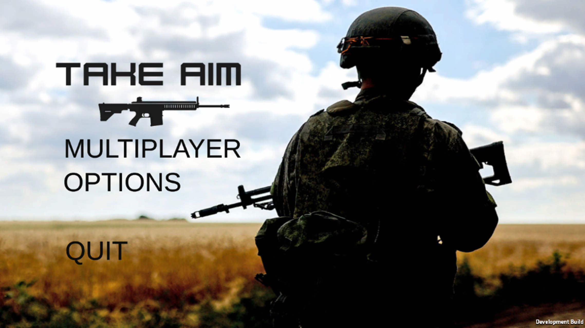

## 🎯 About the Project

TakeAim is a realistic multiplayer first-person shooter game developed in Unity where soldiers battle across natural terrains to determine the most powerful combatant. Experience intense multiplayer action with synchronized gameplay across networks.

**Development Period:** July 2022 - August 2022  
**Associated with:** Higher Institute for Applied Sciences and Technology

### 🚀 Key Features

- **Multiplayer Gameplay**: Host or join games with friends
- **Diverse Terrains**: Choose between rural and desert environments
- **Network Synchronization**: Real-time player action synchronization
- **Immersive Experience**: High-quality audio and visual effects
- **Realistic Combat**: Engaging FPS mechanics with various weapons

## 🎮 Screenshots

### Gameplay
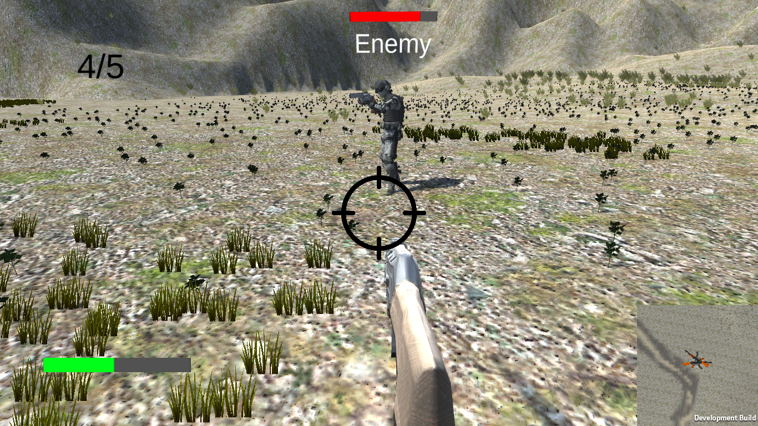
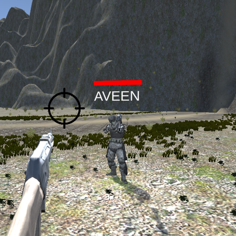
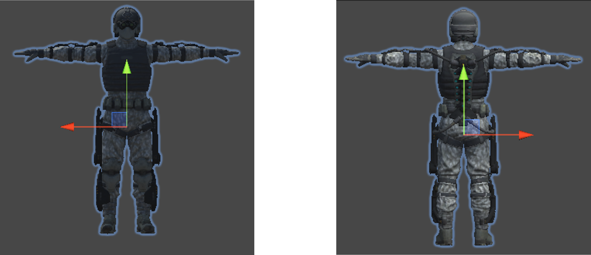
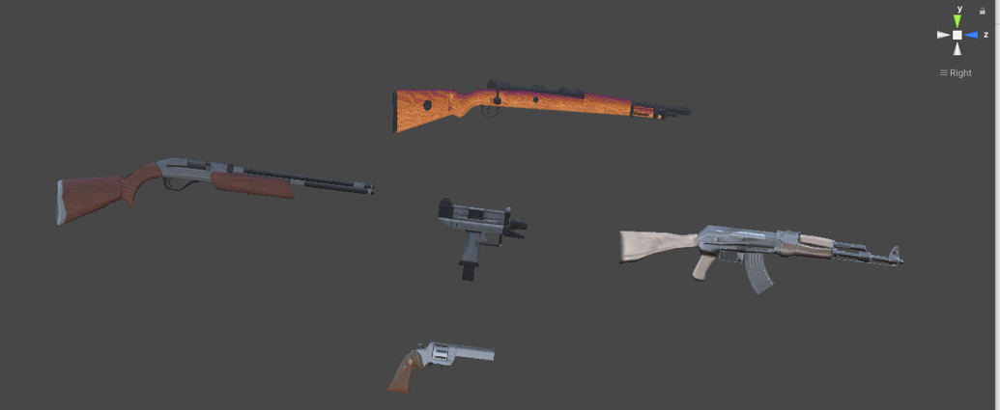

### Terrains
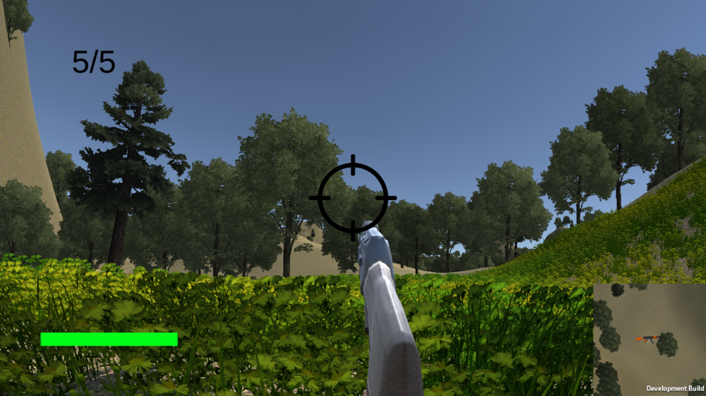
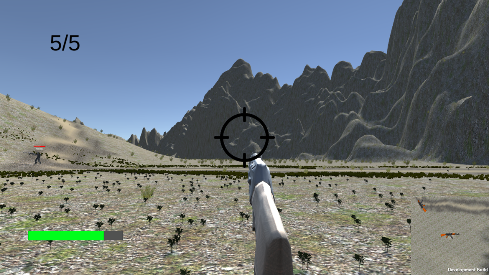

### User Interface
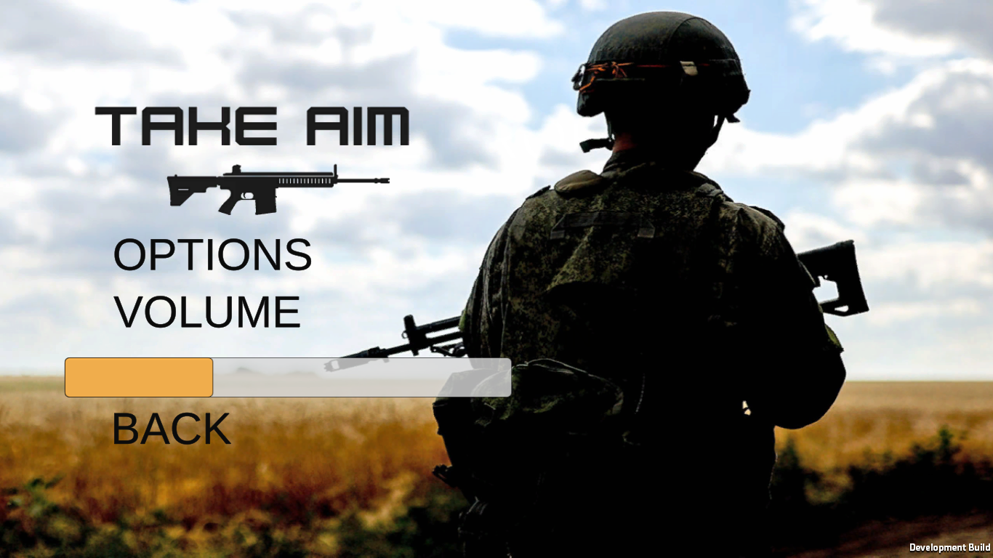
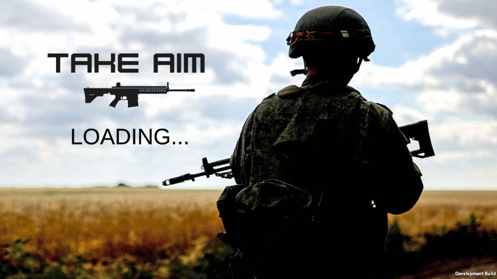
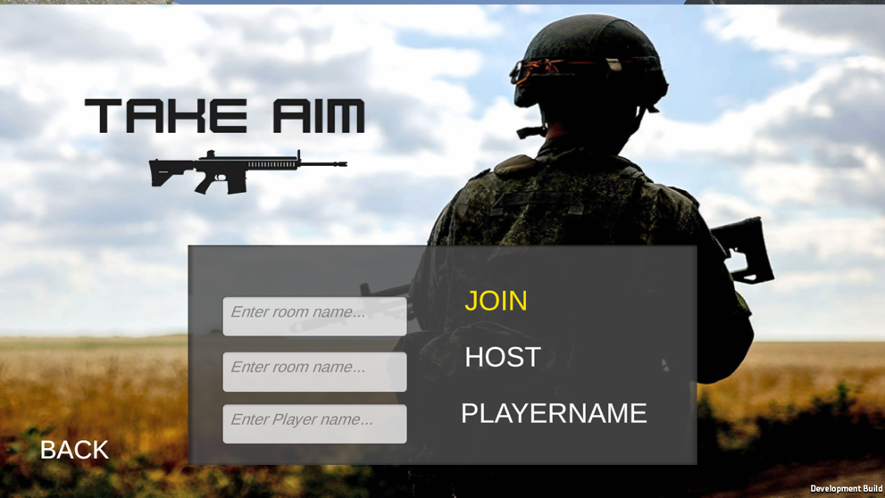
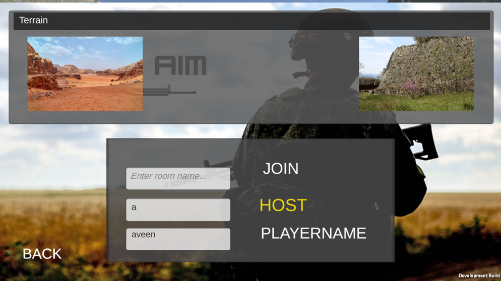
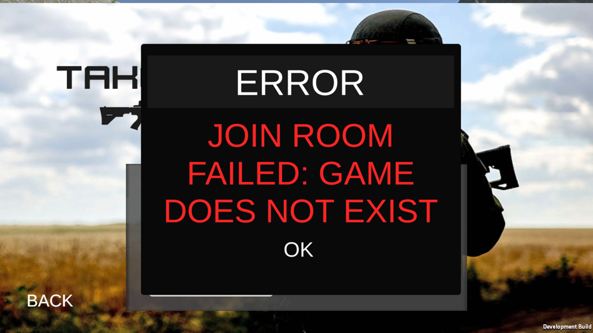
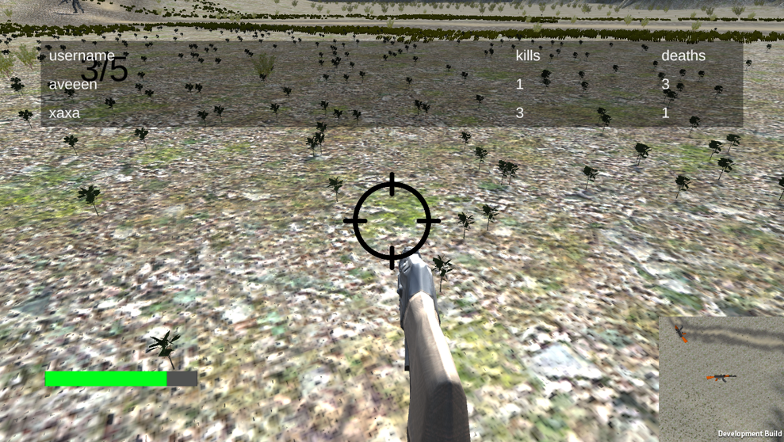

## 🎥 Demo Video

## 📥 Download & Play

### Option 1: Download Executable
1. Go to the [Releases section](Releases/TakeAim1.6.rar) of this repository
2. Download the latest version (`TakeAim-v1.0.zip`)
3. Extract the zip file
4. Run `TakeAim.exe` to play

### Option 2: Build from Source
1. Clone this repository
2. Open the project in Unity (version X.X or later)
3. Build for your target platform
4. Run the built executable

## 🛠️ Technical Details

- **Engine**: Unity
- **Programming Language**: C#
- **Network Architecture**: Client-server model
- **Platform**: Windows
- **Key Technologies**:
  - Unity Networking
  - Audio Visual Systems
  - Game Design & UI
  - Graphics Programming

## 🎯 Game Modes

- **Multiplayer Deathmatch**: Battle against other players
- **Team-based Combat**: Coordinate with teammates
- **Custom Matches**: Host with preferred settings and terrain

## 🌍 Terrains

- **Rural Environment**: Lush forests, hills, and hidden paths
- **Desert Landscape**: Open spaces, dunes, and strategic vantage points

## 🔧 Installation

### Prerequisites
- Windows 7/8/10/11
- DirectX 11 compatible graphics card
- 2GB RAM minimum, 4GB recommended

### Steps
1. Download the latest release from the [Releases page](Releases/TakeAim1.6.rar)
2. Extract the downloaded zip file
3. Run `AveinDemo.exe`
4. Follow the in-game instructions to host or join a game

## 🎮 How to Play

### Hosting a Game
1. Launch the game
2. Click "Host Game"
3. Select your preferred terrain (Rural/Desert)
4. Wait for players to join
5. Start the match when ready

### Joining a Game
1. Launch the game
2. Click "Join Game"
3. Enter the host's IP address
4. Connect and wait for the game to start

### Controls
- **WASD**: Movement
- **Mouse**: Aim/Look
- **Left Click**: Shoot
- **R**: Reload
- **Space**: Jump
- **Tab**: Scoreboard

## 👨‍💻 Development

This project was developed as part of academic work at the Higher Institute for Applied Sciences and Technology, demonstrating skills in:

- Game Development & Design
- C# Programming
- Client-server Application Development
- Graphics Programming
- Audio Visual Systems
- Unity Engine
- UI/UX Design

